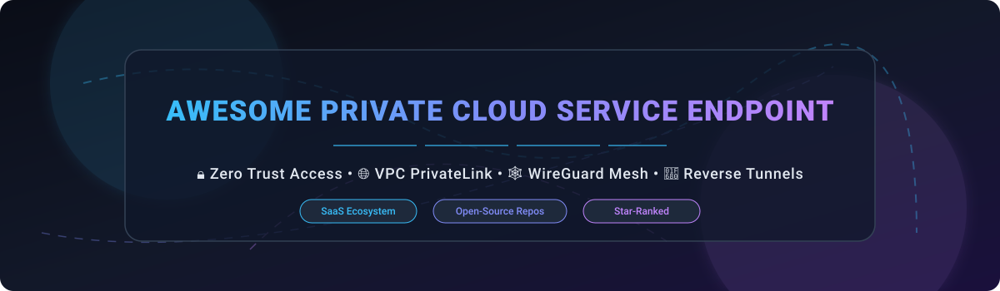

  

  
  
  
  
  
  

> **A curated landscape of commercial SaaS platforms, private endpoint services, zero-trust network access (ZTNA), service meshes, and open-source WireGuard overlay networks.** 🚀

**📅 Last updated: October 2026**

This repository tracks notable **commercial private service endpoint platforms** and **open-source projects** designed to securely connect services privately across cloud providers (AWS, Azure, GCP), virtual private clouds (VPCs), microservices, and on-premises infrastructure — eliminating public internet exposure.

---

## 📋 Table of Contents

- [🗺️ Overview & Industry Landscape](#%EF%B8%8F-overview--industry-landscape)
- [💼 Commercial SaaS & Hosted Platforms](#-commercial-saas--hosted-platforms)
- [🔓 Open-Source GitHub Projects](#-open-source-github-projects)
- [🛠️ Additional Protocol & VPN Libraries](#%EF%B8%8F-additional-protocol--vpn-libraries)
- [🏗️ Architectural Comparison & Frameworks](#%EF%B8%8F-architectural-comparison--frameworks)
- [🤝 How to Contribute](#-how-to-contribute)
- [💖 Support & Community](#-support--community)
- [🌟 Star History](#-star-history)
- [⚠️ Disclaimer & Security Considerations](#%EF%B8%8F-disclaimer--security-considerations)

---

## 🗺️ Overview & Industry Landscape

Modern cloud infrastructure demands secure service-to-service communication that avoids public IP routing. Commercial solutions like **AWS PrivateLink**, **Azure Private Link**, and **Google Cloud Private Service Connect** deliver VPC-native private endpoint connectivity across cloud boundaries. Concurrently, open-source innovations powered by **WireGuard**, **Envoy proxy**, **Rust**, and **eBPF** — such as **NetBird**, **Netmaker**, **Tailscale/Headscale**, **frp**, and **Istio** — empower platform engineering teams to build self-hosted private cloud networks with custom access controls and Zero Trust sovereignty. 🛡️

---

## 💼 Commercial SaaS & Hosted Platforms

> 📊 **Sector Market Size & Structure**: The global Private Cloud Service Endpoint & Zero Trust Network Access (ZTNA) sector is estimated at **$15.2 Billion in 2026** (projected to reach $34.5 Billion by 2030 at a CAGR of 22.8%). The market is **moderately fragmented**: cloud hyper-scalers (Microsoft Azure, AWS, GCP) dominate infrastructure-level VPC private endpoints, while specialized ZTNA, WAN, and edge mesh vendors (Zscaler, Cloudflare, Tailscale, Kong) compete vigorously for application-layer overlay and developer connectivity workloads.

The following table lists top commercial SaaS and cloud-native private endpoint solutions, **sorted by parent company size / market valuation (descending)**: 📈

| 🏢 Product / Platform | 👑 Parent Company | 💰 Company Size (Valuation / Revenue) | 🏷️ Specific Starting Price | 🎁 Free Tier / Trial Limits | ⚡ Capabilities & Primary Use Case |
| :--- | :--- | :--- | :--- | :--- | :--- |
| **[Azure Private Link](https://azure.microsoft.com/en-us/products/private-link/)** | Microsoft Corp | **$3.20 Trillion** Market Cap | $0.01 / Private Endpoint / hour + $0.01 / GB data processed | $200 free credit for 30 days + 12 months select free services | Azure-native private endpoints connecting VNets directly to Azure PaaS & third-party services over Microsoft backbone |
| **[AWS PrivateLink](https://aws.amazon.com/privatelink/)** | Amazon.com Inc | **$2.10 Trillion** Market Cap | $0.01 / VPC Endpoint / hour + $0.01 / GB data processed | 1,000 hours of VPC Endpoint usage / month for 12 months under AWS Free Tier | AWS-native private connectivity between VPCs, AWS services, and on-prem networks without exposing traffic to public internet |
| **[Google Cloud Private Service Connect](https://cloud.google.com/vpc/docs/private-service-connect)** | Alphabet Inc | **$2.10 Trillion** Market Cap | $0.01 / endpoint / hour + $0.01 / GB egress data processed | $300 free trial credits valid for 90 days across GCP resources | GCP-native private VPC endpoints connecting consumer VPCs to producer services over Google's global network |
| **[Cloudflare Magic WAN](https://www.cloudflare.com/)** | Cloudflare, Inc | **$35.0 Billion** Market Cap | $500.00 / month per network connector base rate | 30-day Enterprise Proof-of-Concept with full Magic WAN testing features | Enterprise WAN-as-a-Service integrating Zero Trust Network Access across branch offices and multi-cloud data centers |
| **[Zscaler Private Access (ZPA)](https://www.zscaler.com/products/zscaler-private-access)** | Zscaler, Inc | **$30.0 Billion** Market Cap | $5.00 / user / month (Business Edition, billed annually) | 14-day interactive trial for up to 50 test users & 5 Application Connectors | Market-leading cloud-native Zero Trust Network Access (ZTNA) platform providing secure access to private corporate apps |
| **[HashiCorp Consul (HCP)](https://www.consul.io/)** | IBM / HashiCorp | **$6.40 Billion** Enterprise Value | $0.027 / client instance hour (~$20.00 / month per node) | $50.00 in free HCP cloud credits valid for 30 days upon registration | Managed cloud service discovery, service mesh, and mTLS security automation across multi-cloud environments |
| **[Kong Mesh](https://konghq.com/)** | Kong Inc | **$2.00 Billion** Valuation | $250.00 / service / year (~$20.83 / month per service node) | 30-day enterprise free trial for up to 25 mesh nodes | Enterprise-grade multi-cluster and multi-cloud service mesh built on Kuma and Envoy proxy |
| **[Tailscale](https://tailscale.com/)** | Tailscale Inc | **$1.00 Billion** Valuation | $6.00 / user / month (Starter Plan, billed annually) | Free-forever Personal Plan: Up to 3 users and 100 connected devices included | Zero-config WireGuard mesh VPN featuring single sign-on (SSO), MagicDNS, and granular access control lists (ACLs) |
| **[Ngrok](https://ngrok.com/)** | Ngrok Inc | **$300 Million** Valuation | $10.00 / user / month (Pay-As-You-Go Personal Plan) | Free-forever Developer Plan: 1 online agent, 1 static domain, 1 GB/mo data transfer | Ingress traffic management and secure reverse tunneling for local servers, APIs, and microservices |
| **[Traefik Hub](https://traefik.io/)** | Traefik Labs | **$250 Million** Valuation | $29.00 / month (Pro Plan, includes up to 5 services) | Free-forever Developer Plan: Up to 3 services/APIs and 5,000 monthly operations | Cloud-native networking platform offering unified API gateway, ingress routing, and edge service mesh |

---

## 🔓 Open-Source GitHub Projects

Open-source tools form the backbone of modern self-hosted overlay networks, service meshes, and reverse proxy tunnels. Below is a curated list of top GitHub repositories, **sorted by GitHub star count (descending)**. 🌟

> 💡 *Note: Click on any star badge beside a project name to view its official GitHub stargazers page.*

| Rank | 📦 Project & Repository | ⭐ Star Count | 📜 License | 🏷️ Category | ⚡ Key Features & Architecture |
| :---: | :--- | :---: | :---: | :--- | :--- |
| 1 | **[frp](https://github.com/fatedier/frp)**  | **109,754** | Apache-2.0 | Reverse Proxy Tunnel | Fast reverse proxy for exposing local servers behind NAT or firewalls to the internet with TCP/UDP/HTTP support |
| 2 | **[Traefik](https://github.com/traefik/traefik)**  | **65,096** | MIT | Ingress & Proxy | Modern cloud-native application proxy and ingress controller featuring dynamic automatic service discovery |
| 3 | **[Headscale](https://github.com/juanfont/headscale)**  | **44,393** | BSD-3-Clause | Overlay Control Plane | Self-hosted open-source implementation of the Tailscale control server for complete self-sovereign mesh networking |
| 4 | **[Istio](https://github.com/istio/istio)**  | **38,427** | Apache-2.0 | Enterprise Service Mesh | CNCF-graduated enterprise service mesh providing advanced traffic management, mTLS encryption, and rich telemetry |
| 5 | **[Tailscale Client](https://github.com/tailscale/tailscale)**  | **37,202** | BSD-3-Clause | Overlay Mesh Node | Open-source client daemon for WireGuard-based mesh networks with automated NAT traversal and cross-platform support |
| 6 | **[Consul](https://github.com/hashicorp/consul)**  | **30,093** | BSL-1.1 | Service Mesh & Discovery | Multi-datacenter service discovery, distributed key-value store, and zero-trust service mesh mTLS authorization |
| 7 | **[NetBird](https://github.com/netbirdio/netbird)**  | **29,786** | Apache-2.0 | Zero Trust Network | WireGuard-based peer-to-peer overlay network platform integrated with identity providers (SSO/MFA) and admin UI |
| 8 | **[Envoy](https://github.com/envoyproxy/envoy)**  | **29,041** | Apache-2.0 | Service Proxy | High-performance C++ edge/middle/service proxy designed as the foundational engine for modern service meshes |
| 9 | **[localtunnel](https://github.com/localtunnel/localtunnel)**  | **22,488** | MIT | Development Tunnel | Simple Node.js CLI tool that exposes local development servers to publicly accessible web URLs |
| 10 | **[Teleport](https://github.com/gravitational/teleport)**  | **20,966** | AGPL-3.0 | Zero Trust Access | Identity-aware access proxy for SSH servers, Kubernetes clusters, databases, and internal web applications |
| 11 | **[Nebula](https://github.com/slackhq/nebula)**  | **18,418** | MIT | Scalable Mesh Network | Portable mesh overlay networking tool created by Slack focusing on high throughput, security, and low overhead |
| 12 | **[ZeroTier](https://github.com/zerotier/ZeroTierOne)**  | **17,159** | BSL-1.1 | Software-Defined SDN | Smart virtual Ethernet switch creating secure peer-to-peer virtual networks across cloud, desktop, and mobile |
| 13 | **[Chisel](https://github.com/jpillora/chisel)**  | **16,624** | MIT | Secure HTTP Tunnel | Fast TCP/UDP tunnel over HTTP secured by SSH protocol encryption and client fingerprint authentication |
| 14 | **[rathole](https://github.com/rapiz1/rathole)**  | **14,301** | Apache-2.0 | Rust Tunnel Proxy | Ultra-lightweight and memory-efficient reverse proxy written in Rust for NAT traversal and fast port forwarding |
| 15 | **[Netmaker](https://github.com/gravitl/netmaker)**  | **11,821** | SSPL / Apache | Kernel WireGuard Mesh | Creates flat, automated, and encrypted WireGuard overlay networks connecting multi-cloud and edge infrastructure |
| 16 | **[bore](https://github.com/ekzhang/bore)**  | **11,527** | MIT | CLI Tunneling Tool | Minimalistic and blazingly fast CLI tool written in Rust for exposing local ports to remote servers |
| 17 | **[Linkerd](https://github.com/linkerd/linkerd2)**  | **11,506** | Apache-2.0 | Micro-Proxy Mesh | Ultralight, security-first Rust micro-proxy service mesh designed specifically for Kubernetes workloads |
| 18 | **[Pomerium](https://github.com/pomerium/pomerium)**  | **5,027** | Apache-2.0 | Context Access Proxy | Identity and context-aware reverse proxy delivering BeyondCorp-style Zero Trust access to web applications |
| 19 | **[sish](https://github.com/antoniomika/sish)**  | **4,789** | MIT | SSH Tunnel Server | Self-hosted HTTP(S)/WS(S)/TCP tunnel server utilizing standard SSH client features as an open-source ngrok alternative |
| 20 | **[OpenZiti](https://github.com/openziti/ziti)**  | **4,420** | Apache-2.0 | Programmable ZTNA | Open-source zero-trust networking platform with embeddable developer SDKs and zero-trust edge routers |
| 21 | **[Kuma](https://github.com/kumahq/kuma)**  | **4,011** | Apache-2.0 | Multi-Zone Mesh | CNCF sandbox multi-zone service mesh for containers, Kubernetes, and virtual machine environments |

---

## 🛠️ Additional Protocol & VPN Libraries

For custom security architectures, foundational networking protocols and libraries provide underlying tunnel building blocks: ⚙️

- 🔒 **[WireGuard](https://www.wireguard.com/)**: Modern, ultra-fast VPN protocol using state-of-the-art cryptography.
- 🔑 **[OpenVPN](https://openvpn.net/)**: Battle-tested open-source VPN protocol with extensive cross-platform client ecosystems.
- 🛡️ **[strongSwan](https://www.strongswan.org/)**: Open-source IPsec-based VPN solution for multi-cloud security gateways.
- 🐧 **[Libreswan](https://libreswan.org/)**: IPsec implementation for Linux supporting IKEv1 and IKEv2 protocols.
- 🕸️ **[Tinc VPN](https://www.tinc-vpn.org/)**: Self-routing peer-to-peer mesh VPN daemon with automated key handling.
- 🔗 **[Innernet](https://github.com/tonolino/innernet)**: Private network system built on top of WireGuard designed for simple ACL management.

---

## 🏗️ Architectural Comparison & Frameworks

When building private connectivity solutions across multi-cloud environments, architecture teams typically combine multiple tools: 🧩

1. 🌐 **Overlay Networking Layer**: Deploy **Netmaker** or **NetBird** for kernel WireGuard performance across AWS, Azure, GCP, and bare metal servers.
2. 🔑 **Control & Identity Layer**: Integrate **Headscale** or **Pomerium** to enforce identity-based Zero Trust access control via Single Sign-On (SSO).
3. 🕸️ **Service Mesh & Discovery**: Use **Consul** or **Istio** / **Linkerd** for intra-cluster mTLS encryption, service authorization, and telemetry.
4. 🚀 **Local Development Tunnels**: Utilize **frp**, **Chisel**, or **sish** to establish temporary encrypted tunnels to internal endpoints without changing public DNS records.

---

## 🤝 How to Contribute

Contributions are welcome! To contribute to this curated ecosystem: 💡

1. **Fork** this repository.
2. Add your commercial or open-source entry in the appropriate section.
3. Ensure entries include accurate pricing details, free tier limits, star badges linking to `/stargazers`, and factual descriptions.
4. Open a **Pull Request (PR)** with a summary of the additions.

---

## 💖 Support & Community

Thank you for exploring this curated repository! If you find it helpful for your infrastructure or development needs, please consider supporting the project:

- ⭐ **Star** this repository to increase visibility and help others discover top private connectivity tools.
- 🔀 **Fork** it to contribute updates or customize entries for your engineering team.
- 📢 **Share** it with fellow network engineers, platform teams, and DevOps practitioners.
- ☕ **Sponsor / Buy Me a Coffee**: Support ongoing open-source maintenance and research via the [GitHub Sponsor Dashboard](https://github.com/sponsors/ishandutta2007).

---

## 🌟 Star History

---

## ⚠️ Disclaimer & Security Considerations

- This list is **community-curated** for educational and architectural reference — it does not constitute an endorsement.
- Private cloud service endpoints control access to mission-critical workloads. Always verify security posture, key rotation policies, and license compliance before deploying in production environments.
- Commercial private endpoints (e.g., AWS PrivateLink, Azure Private Link) incur hourly endpoint charges and data processing fees. Open-source solutions reduce software costs but require operational upkeep and infrastructure provisioning.

---

**Maintained with ❤️ for network engineers, platform engineering teams, and cloud architects seeking private connectivity sovereignty.**
